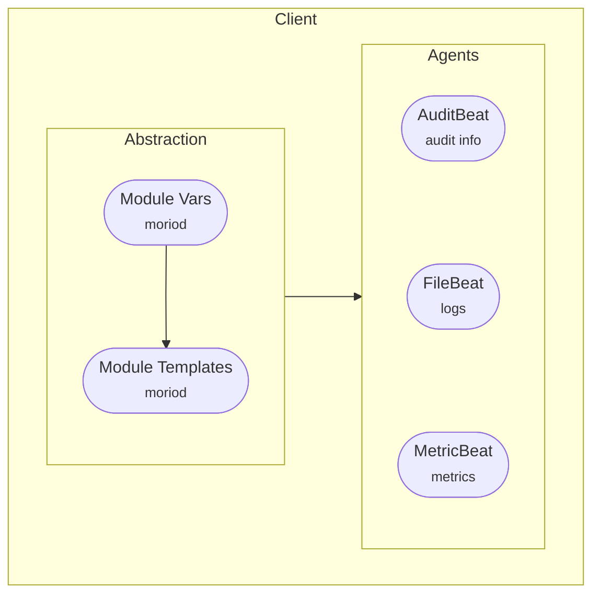
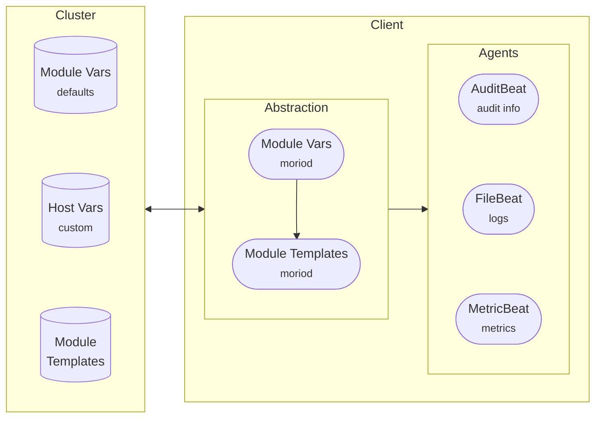

We have released version 0.8.0 of Morio, a new minor release that
overhauls the way we manage Morio client configurations.

<!-- truncate -->

## Why we decided to do things differently

In our previous post [announcing Morio v0.7.0](/blog/2025/02/06/v0.7.0) we
wrote:

> _We've been running Morio in production for a while now, and as we continue to
> integrate more and more systems with it, the amount of data flowing through our
> Morio instance increases._

That post focused on optimizing performance of the Morio nodes by replacing
Logstash with Vector, and in that context, the focus was on the amount of data
flowing through Morio.

Today's release is also triggered by our own experience running Morio, but this
time around, the focus is on the client side, and the overhead of integrating
systems with Morio.

We always wanted to make this as easy as possible, but while we have done some
work on this in the past, we felt that it was still too cumbersome to enroll
clients.

We wanted to do better, so we set out to do that. And this release brings that
new functionality.

## Understanding the Morio client and its abstractions

Below is a schematic overview of the Morio client prior to this release:



At the lowest level, we have the various Beats agents.
They have their own configuration, and nothing stops you from editing that
configuration directly.

To further facilitate the management of the client configuration, we added **a
first abstraction**: adding module templates and vars. This allows us (and you)
to re-use configuration across clients, without losing the ability to tweak the
configuration to the specific local needs of the client.

For example, you may be collecting logs from an Apache web server on multiple
systems, but the logs are not always in the same place. Templates allow you to
re-use the same configuration, and simple use a local var to specify the log
location.

Useful as that is on its own, it really shines when coupled with [MorioHub](/hub/),
which is where we publish a collection of client module templates for common
use-cases.

But there is still the matter of making all those module template files
available on the client. And managing all those variables and templates without
any central management capabilities can be a head-scratcher.

So, in this release, we decided to add a **second abstraction**:



You can still use the low-level approach of configuring the agents directly.
You can also still use the local templates and vars if you prefer that.

But, there's now a central component to facilitate management of the client
configuration.
The idea is simple: The Morio cluster will _preseed_ the client modules, and
store module files and (default) module vars in its database.

The client can then `pull` its configuration from the cluster. When it does,
it will receive the template files for all modules it has enabled, as well as
all module and custom vars.

The client can also `push` its local configuration to the cluster. In that case,
the list of enabled modules and any custom vars will be updated centrally.
Note that you cannot push template files.
They need to be preseeded on the cluster.

In a future release, we will extend this with the ability to centrally manage
clients by assigning modules, settings vars, and so on.
This centralized management is not yet included in this release.
We wanted to start using this ourselves as soon as possible, so we decided
to release this without all of the UI work on central management implemented.

## Inventory no longer requires stream processing

Another advantage of this new approach is that it allows us to build out
an inventory without relying on stream processing.

Prior to this release, Morio could already build out an inventory, but
it relies on stream processing via the _tap service_ to do so, using the
information in the data flowing through Morio to build out the inventory.

The new `join` command in the client submits a report with information about
the system the client is running on. As a result, Morio can now build out an
inventory even if you do not run any stream processing.

You can also trigger the submission of such a report with the new `report`
command in the client:

```
sudo morio report
```

Furthermore, Morio will now also keep track of packages installed on the
system, which is info that we could not collect previously.

## The client now comes with a new listener mode

But wait, there's more. The new Morio client comes with a listen mode:

```
sudo morio listen
```

We install a `systemd` service file for this named `morio-listener`,
but it is optional to run this service.

When you do however, the client will deamonize and connect to the Kafka
broker and listen for events in the `clients` channel.
Through the API or the UI, you can then trigger commands on one or more
clients, who will pick them up and report their status back to the API.

To be clear: While the client does listen for commands, it does so by
connecting to the Kafka broker. The Morio client does not listen on
any ports, and this has not changed.  
The commands are also limited to specific client-related things, such as
pulling or pushing its config. We do not allow running arbitrary commands on
the host through the Morio client.

## Installing a client is now just like installing a node

Our initial idea to have the Morio cluster generate pre-configured client
packages was not all bad, but in practice it resulted in a lot of complexity
that we had to bake into the Morio nodes.

With this release, we have scrapped that approach, and instead opted for the
same install logic as installing a Morio node.

To **install the Morio client**, all you have to do now is run this command:

```sh
curl -fsSL https://install.morio.it/client | bash
```

For consistency, we have update the command to **install a Morio node** as such:

```sh
curl -fsSL https://install.morio.it/node | bash
```

For more options, including installing from the `canary` or `testing` release
channels, refer to [install.morio.it](https://install.morio.it/).

## Joining the new client to a Morio cluster

As clients no longer ship with everything on board to connect to your local cluster, you will need to join your client to a Morio cluster after you have installed it.

To do so, there is a new `join` command:

```
sudo morio join my.cluster.fqdn.morio.it
```

By default, any client can join the cluster. If you would like to further lock
this down, we have added a new [`REQUIRE_CLIENT_INVITES` feature
flag](/docs/reference/flags/#require_client_invites).

Enabling this feature flag will require clients to present an invite code. You
can generate these invite codes through the API or UI. They come in two types:

- A one-time invite that can only be used once
- A reusable invite that can be used many times

## Updates to our software repositories

We already had an APT repository at
[apt.repos.morio.it](https://apt.repos.morio.it), but now it also carries the
client packages as `morio-client`. We publish these packages for both `amd64`
and `arm64` architectures.

Other packages available from this repository are:

- `moriod`, the Morio node.
- `morio-repo`, a package to setup this repository on your system (renamed from
  `moriod-repo`)

## Caveats

As mentioned earlier, not all high-level functionality is in this release.
In particular, the UI aspects of centrally managing client configuration is
something which we will further implement in subsequent releases.

We also want to point out that it is currently not possible to join a client to
a cluster with [the `ENFORCE_HTTP_MTLS` feature
flag](/docs/reference/flags/#enforce_http_mtls) enabled.
In such a setup, any client who wants to talk to the API needs a valid X.509
certificate to be able to do so. So this feature flag prohibits joining a client
to a cluster. We currently have no plans to address this.

Documentation is lacking on the new client functionality and central management.
We hope to be able to resolve that soon.
