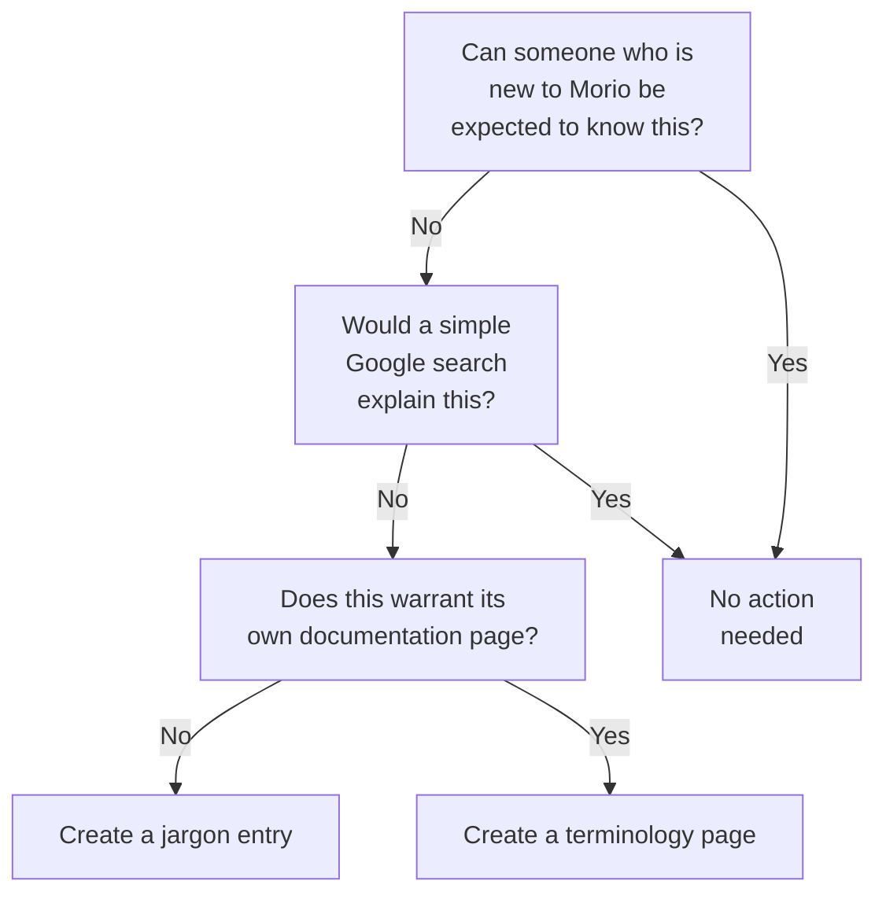

import { JargonTerms, TerminologyTerms } from '@site/src/theme/components/term.js'
import Tabs from '@theme/Tabs'
import TabItem from '@theme/TabItem'

Improving our documentation is one of the easiest ways to start contributing to
Morio. So if you spot a mistake or see something that you can improve, please
do not hesitate to do so.

This guide will show you how you can do that.

<Tip>
### Making quick edits

The easiest way to make changes to the documentation is via the **Edit this
page** link that you can find at the bottom of every documentation page. 

This will take you to the GitHub online editor where you can propose changes
directly.  
<small><b>Note:</b> You need a GitHub account to do this, but they are free.</small>
</Tip>

## Where to find our documentation

We store our documentation as [Markdown](https://www.markdownguide.org/) in git 
and use [Docusaurus][docusaurus] to generate a static website from it, 
which we then publish as [morio.it](https://morio.it/).

Inside our monorepo, the `docs` folder holds the docusaurus setup.
Within that folder, the `docs` subfolder holds the actual markdown content.

So relative to the monorepo root, you can find the markdown of our documentation under `docs/docs`.

<Note>
Apart from documentation, we also publish blog posts using the same docusaurus setup.  
You can find those under `docs/blog`.
</Note>

## Folder structure & file names

The folder structure of the markdown files directly translates to the URL structure of the documentation website.
The file names must always be `readme.md`.

If we take this documenation guide as an example:

- Relative url: <b>/docs/guides/contributors/docs</b>
- Path to the markdown file: docs<b>/docs/guides/contributors/docs</b>/readme.md

That not only makes it easy to find the source markdown of any given page, it
also has implications for how you should structure the markdown content:

- All markdown files under `docs/docs` should be named `readme.md`
- All folders under `docs/docs` should have a URL-friendly name, using only the characters `a-z`, `0-9`, and `-`
- Every folder should have a `readme.md`, no empty folders

## Frontmatter

Frontmatter is metadata that sits at the top of a markdown file.
Strictly speaking, it is not part of markdown, but rather a list of key/value pairs in YAML format that starts and ends with `---`.
Here's an example:

```md
---
title: Documentation Guide
---

Improving our documentation is one of the easiest ways to start contributing to
Morio. So if you spot a mistake or see something that you can improve, please
do not hesitate to do so.

```

The `title` entry is mandatory. In other words, __every documentation page must
have its title set in frontmatter__.

As in YAML, you do not have to wrap your title in quotes, unless when it holds
characters that would trip up the YAML parser (like when your title itself
includes quotations marks).


<Related> 
For an overview of all supported frontmatter, see [the Docusaurus documentation
on frontmatter in
docs](https://docusaurus.io/docs/api/plugins/@docusaurus/plugin-content-docs#markdown-front-matter)
</Related>

## Tags

The frontmatter example above can be further extended to add tags to the page.
Here is an example:

```md
---
title: Documentation Guide
tags:
  - contributors
---

Improving our documentation is one of the easiest ways to start contributing to
Morio. So if you spot a mistake or see something that you can improve, please
do not hesitate to do so.

```

We have added the `contributors` tag to this page. Marking it as a page that is
relevant for Morio contributors.

Tags are a way to group pages together that cover the same topic or category.
Docusaurus will automatically create an overview page of all documentation that
is tagged with any given tag.

For example, the pages tagged with `contributors` can be found at
[/docs/tags/contributors](/docs/tags/contributors).  Docusaurus will also
include the tags at the bottom of the page, and they link to their overview
pages.

Tags are most useful as a carefully curated collection of pointers.
To ensure that, all tags must be defined in the `docs/docs/tags.yml` file.

<Scode>
[github.com/certeu/morio/blob/develop/docs/docs/tags.yml](https://github.com/certeu/morio/blob/develop/docs/docs/tags.yml)
</Scode>

The file holds tags that can be defined as such (using our `contributors` tag as 
an example):

```yaml
contributors:
  label: Contributors
  permalink: /docs/tags/contributors
  description: Documentation relevant for contributors
```

As you can see, you can explicitly set a label, permalink, and description.
However, we just rely on the defaults. So you define the tag and do not specify any
properties. Here is how to do that in YAML:

```yaml
contributors:
```

To add a tag, place it on a new line followed by `:`.

<Tip>
An overview of all tags is available at [/docs/tags](/docs/tags).
</Tip>

## Custom components

Docusaurus supports _MDX_ which is markdown with support for custom components.
A number of MDX components are supported out of the box, like [the tabs used on
this page](https://docusaurus.io/docs/markdown-features/tabs).

In addition, we provide some MDX components that you can use in documentation pages.
They are typically various ways to engage the reader with the material.

### Comment

The `Comment` custom component allows you to insert a comment.

<Tabs>
  <TabItem value="mdx" label="MDX" default>
```markup
<Comment by='joost'>
Comments are most useful when something is opinion, rather than fact.
</Comment>
```
  </TabItem>
  <TabItem value="html" label="HTML">
<Comment by='joost'>
Comments are most useful when something is opinion, rather than fact.
</Comment>
  </TabItem>
</Tabs>

### Fixme

The `Fixme` custom component allows you to insert a message indicating something needs work.

<Tabs>
  <TabItem value="mdx" label="MDX" default>
```markup
<Fixme>
Use this to indicate something needs work or is incomplete.
</Fixme>
```
  </TabItem>
  <TabItem value="html" label="HTML">
<Fixme>
Use this to indicate something needs work or is incomplete.
</Fixme>
  </TabItem>
</Tabs>

### Important

The `Important` custom component allows you to insert a message indicating something is important.

<Tabs>
  <TabItem value="mdx" label="MDX" default>
```markup
<Important>
You need to start a new line after the opening tag of a custom component to ensure your markdown within the component will be parsed.
</Important>
```
  </TabItem>
  <TabItem value="html" label="HTML">
<Important>
You need to start a new line after the opening tag of a custom component to ensure your markdown within the component will be parsed.
</Important>
  </TabItem>
</Tabs>

### Note

The `Note` custom component allows you to insert something you want to draw the reader's attention to.

<Tabs>
  <TabItem value="mdx" label="MDX" default>
```markup
<Note>
This is a good way to draw the reader's attention to additional information.
</Note>
```
  </TabItem>
  <TabItem value="html" label="HTML">
<Note>
This is a good way to draw the reader's attention to additional information.
</Note>
  </TabItem>
</Tabs>

### Related

The `Related` custom component allows you to insert a message with links to related content.

<Tabs>
  <TabItem value="mdx" label="MDX" default>
```markup
<Related>
If you are new to MDX, you can check the documentation at [mdxjs.com](https://mdxjs.com/).
</Related>
```
  </TabItem>
  <TabItem value="html" label="HTML">
<Related>
If you are new to MDX, you can check the documentation at [mdxjs.com](https://mdxjs.com/).
</Related>
  </TabItem>
</Tabs>

### RepoFile

The `RepoFile` custom component allows you to create a link for a file in the
_monorepo_. The link will point to the same file on GitHub, specifically in the default
`develop` branch..

<Tabs>
  <TabItem value="mdx" label="MDX" default>
```markup
To see this example, check out <RepoFile>/docs/guides/contributors/docs/readme.md</RepoFile>.
```
  </TabItem>
  <TabItem value="html" label="HTML">
To see this example, check out <RepoFile>/docs/guides/contributors/docs/readme.md</RepoFile>.
  </TabItem>
</Tabs>


### Scode

The `Scode` custom component allows you to insert a message with links to relevant source code.

<Tabs>
  <TabItem value="mdx" label="MDX" default>
```markup
<Scode>
The Morio source code is available at [github.com/certeu/morio](https://github.com/certeu/morio).
</Scode>
```
  </TabItem>
  <TabItem value="html" label="HTML">
<Scode>
The Morio source code is available at [github.com/certeu/morio](https://github.com/certeu/morio).
</Scode>
  </TabItem>
</Tabs>

### Tip

The `Scode` custom component allows you to insert a message with one or more tips for the reader.

<Tabs>
  <TabItem value="mdx" label="MDX" default>
```markup
<Tip>
If there is a lot of information on the page, start with a `Tldr` component that holds a summary.
</Tip>
```
  </TabItem>
  <TabItem value="html" label="HTML">
<Tip>
If there is a lot of information on the page, start with a `Tldr` component that holds a summary.
</Tip>
  </TabItem>
</Tabs>

### Tldr

The `Tldr` custom component allows you to insert a message that summarizes content for the reader.

<Tabs>
  <TabItem value="mdx" label="MDX" default>
```markup
<Tldr>
Too long; Didn't read
</Tldr>
```
  </TabItem>
  <TabItem value="html" label="HTML">
  </TabItem>
</Tabs>

### Warning

The `Warning` custom component allows you to insert a message that warns the reader about potential consequences.

<Tabs>
  <TabItem value="mdx" label="MDX" default>
```markup
<Warning>
Use this when a certain action is potentially descructive.
</Warning>
```
  </TabItem>
  <TabItem value="html" label="HTML">
<Warning>
Use this when a certain action is potentially destructive or problems are likely to occur.
</Warning>
  </TabItem>
</Tabs>

### WithCaption

The `WithCaption` custom component allows you to place a caption under any content.

<Tabs>
  <TabItem value="mdx" label="MDX" default>
```markup
<WithCaption caption="This allows you to put a caption under anything">

</WithCaption>
```
  </TabItem>
  <TabItem value="html" label="HTML">
<WithCaption caption="This allows you to put a caption under anything">

</WithCaption>
  </TabItem>
</Tabs>

## Jargon and Terminology

It is common in technical documentation to use terms or acronyms that the
reader might not be familiar with. This can create a barrier to readers,
especially when those terms are specific to Morio.

To address this, we have extended Docusaurus with two custom features that help you demystify this type of content: __jargon__ and __terminology__.

### Jargon vs Terminology

Both jargon and terminology can be anything that needs explaining.
The difference is that jargon does not warrant or require its own dedicated documentation page.

The following rules can guide you when deciding whether you should create a
jargon term, add a terminology page, or do take no action.

 1. Can someone who is new to Morio be expected to know this?
 2. Would a simple Google search explain this?
 3. Does this warrant its own documentation page?

If the answers are __No__, __No__, __Yes__, create a terminology page.  
If the answers are __No__, __No__, __No__, [create a jargon term](#creating-a-jargon-term).  
For all other cases, no action is required.

The decision tree below visualises these rules:

<WithCaption caption="A decision tree to facilitate decisions about whether or not to create jargon or terminology">



</WithCaption>

Let use some examples to further clarify these rules:

#### `IICB`: Create jargon term
1. This is something rather niche that has little to no meaning outside the context of European Union's administration.
2. People cannot be expected to know this, and a simple Google search is unlikely to help.  
3. Knowing what the IICB is not relevant for understanding Morio. So a dedicated documentation page is not needed.

In this case, we create a jargon term: _IICB_.

#### `flanking node`: Create terminology page
1. This has a specific meaning in Morio and people cannot be expected to know this.
2. Goolging this won't help.
3. This requires proper explanation. A documentation page is the best option here.

In this case, we create a terminology page: _flanking node_..

#### `TLS node`: Do nothing
1. This is common terminology, people are unlikely to be confused by this. But even if they are...
2. A simple Google query will explain this.

In this case, we do nothing.

### Jargon

#### Creating a jargon term

To create a new jargon term, add it to the `jargon` section of the `docs/jargon.mjs` file.

<Scode>
[github.com/certeu/morio/blob/develop/docs/terminology.mjs](https://github.com/certeu/morio/blob/develop/docs/terminology.mjs)
</Scode>

Tthis file has a named export `jargon` which is a pojo that holds `title` and `content` keys.  
You can use HTML in the `content`, but not in the `title`.  
The key of the jargon term should be lowercased and stripped of `.` characters.

Below is an example:

```js
export const jargon = {
  iicb: {
    title: 'IICB',
    content: `<p>The IICB is the European Union's <b>Interinstitutional Cybersecurity Board</b> and the governing body of <b>CERT-EU</b>, the home of Morio.</p>`
  },
}
```

<Note>
#### Restart docusaurus to pick up changes to jargon terms

When running docusaurus locally in develop mode, you will need to restart it to pick up changes to this file.
</Note>

#### Using a jargon term

Once you have created a jargon term, you can use it by _emphesising_ it in your markdown contett.

For exampole, this markdown:

```md
I have no idea what _iicb_ is.
```

Will render as:

I have no idea what _iicb_ is.

The jargon term will be turned into a button that you can click to reveal the meaning of the term.

Jargon terms are case-insensitive. You can write _IICB_, _iicb_, or even _iICb_.

#### List of jargon terms

The following jargon terms are currently available for use in your markdown content:

<JargonTerms />


### Terminology

#### Creating a terminology page

To create a new terminology page, create a folder under `/docs/docs/reference/terminology`.  
The name of the folder should follow [the same rules as any folders under
`docs/docs`](#folder-structure--file-names): use only the characters `a-z`,
`0-9`, and `-`.

Below is an example:

```md
---
title: Broker Node
---

A _broker node_ is any Morio node that provides [the broker service](/docs/guides/services/broker).

A node in a Morio deployment can have two different roles, _broker node_, or _flanking node_.
As you may have guessed, a _flanking node_ is a node that does not provide the broker service.
```

Next, you need to add the page to the `terminology` section of the `docs/jargon.mjs` file.

<Scode>
[github.com/certeu/morio/blob/develop/docs/terminology.mjs](https://github.com/certeu/morio/blob/develop/docs/terminology.mjs)
</Scode>

First import the page's frontmatter:

```js
import { frontMatter as brokerNode } from './docs/reference/terminology/broker-node/readme.md'
```

Then add it to the `terminology` object:

```js
export const terminology = {
  'broker node': {
    title: brokerNode.title,
    url: `/docs/reference/terminology/broker-node`,
  },
}
```

#### Using a terminology term

Once you have created a terminology term, you can use it by _emphesising_ the page title in your markdown contett.

For exampole, this markdown:

```md
I have no idea what a _broker node_ is.
```

Will render as:

I have no idea what _broker node_ is.

The terminology term will be turned into a link that leads to the terminology page.

Terminology terms are case-insensitive, but will always us the terminology page's title.  
So you can write _broker node_, _Broker Node_, or even _BroKEr NoDE_, but it will
all look the same.

#### List of terminology pages

The following terminology pages are currently available for use in your markdown content:

<TerminologyTerms />

## Includes

Sometimes, you may find yourself repeating the same information on various
documentation pages.  You could create a page for it and link to it, but
perhaps it's more elegant to inline the information in the page.

In a case like this, you can use an include. This allows you import _MDX_
content into your documentation page.

### Creating an include page

To create an include page, add the page to the <RepoFile>docs/includes</RepoFile> folder in the _monorepo_.

Unlike the <RepoFile>docs/docs</RepoFile> folder where we rely on folder
structure, all files should be in the same folder.

As such, you should give it a name that conveys the intent of the include.
As an practical example, the difference between the built container images for
the development environment and production is something that is relevant on
various documentation pages.

So, the documentation is kept in the <RepoFile>docs/includes/docker-env-diffs.md</RepoFile> file.

### Importing and using the include file

Once created, you can import the file as any other import in your `readme.md`:

```mdx
--- 
title: Example of how to use an include
---

import DockerBuildEnvDiffs from '@site/includes/docker-env-diffs.md'

Some (optinoal) other content here.

<DockerBuildEnvDiffs />
```

A few things to note:

- The `import` statement should be the first thing after the frontmatter
- Use the `@site/includes/` prefix to import include files.
- Since we are using the default export, the name you give it can by anything (here we used `DockerBuildEndDiffs`
- This will be used as a React component, so you __must__ pick a name tht starts with a Capital.
- Output the info as a react component: `<DockerBuildEnvDiffs />` 

See <RepoFile>docs/reference/contributors/monorepo/run-scripts/build-api/readme.md</RepoFile> for an example.

## Tips for writing great documentation

Here is some friendly advice to help you write great documentation:

#### Don't use gen-AI

Writing yourself will make you a better writer.

<Note>
We take pride in the fact that all of Morio's documentation is written by actual human beings.  
Please respect that and don't reach for Chat-GPT or whatever the generative AI flavor of the day is.
</Note>


#### Write now, edit later

Just write. Don't worry about grammar or making mistakes. It's fine.

It doesn't have to be perfect, it just needs to be written down.

Anybody can can edit to improve form or structure. If you have a spell checker, use it. It truly helps.

#### Use plain language

Explain things in simple words. Write short plain sentences.
Use headings and paragraphs to structure your writing.

#### Get to the point

Say what you need to say. No more. No less.  
Make your text as short as possible; your documentation will be better this way.

#### Use meaningful hyperlinks

Make hyperlinks meaningful:

- **Good link**: [Tips for writing great documentation](/docs/guides/contributors/docs/#tips-for-writing-great-documentation)
- **Bad link**: [click here](/docs/guides/contributors/docs/#tips-for-writing-great-documentation)

#### Define jargon

Don't use jargon without explaining it.

#### More advice

The ["Technical Writing From Google" course](https://developers.google.com/tech-writing/one) comes highly recommended.

Remember that the worst possible documentation is the documentation that is never written.

## Running the documentation site locally

<Note>
We assume you have git, and NodeJS installed.
</Note>

To run a local instance of the documentation site -- higly recommended if
you're looking to make non-trivial changes to the documentation -- you can
follow these steps:

```sh title="Terminal"
git clone git@github.com:certeu/morio.git
cd morio
npm install
cd docs
npm run start
```

In other words:

- Clone the repository
- Install dependencies
- Run `npm run start` in the `docs` folder

The docs site will now be running on http://localhost:3000 and any changes you
make will be hot-reloaded.

<Warning>
#### Untested on Windows

While we support Microsoft Windows as a platform for the Morio client, no Microsoft Windows is used in the development of Morio.
If you are on Windows, your mileage may vary.
</Warning>


## Redoc Integration

We integration our API reference documentation by using [redocusaurus](https://github.com/rohit-gohri/redocusaurus) which integrates [redoc](https://github.com/redocly/redoc) in [docusaurus](https://docusaurus.io/).

The config lives in `docusaurus.config.js` and it adds these two routes:

- [/oas-api](/oas-api) for the Management API
- [/oas-core](/oas-core) for the Core API


[netlify]: https://www.netlify.com/
[docusaurus]: https://docusaurus.io/
[docs]: https://github.com/certeu/morio/tree/develop/docs/docs
[repo]: https://github.com/certeu/morio
