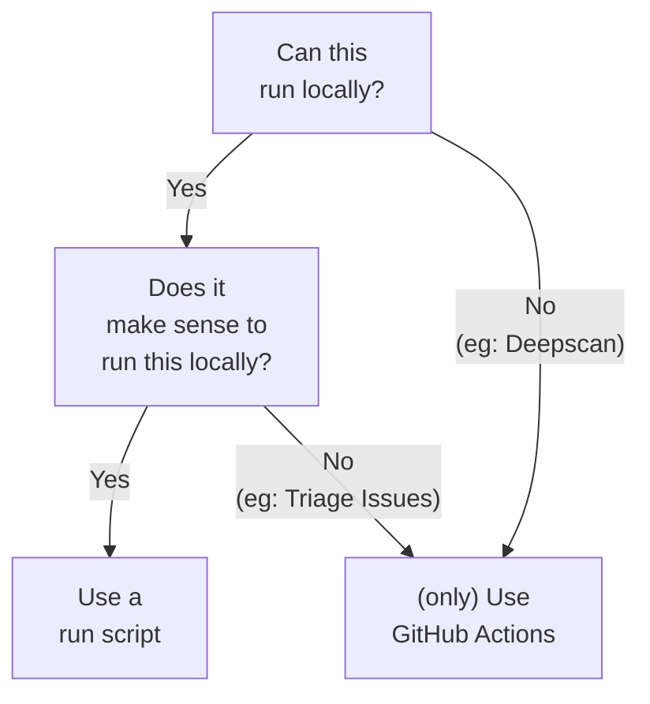

The Morio source code is hosted in the [certeu/morio][repo] repository on
GitHub, and a read-only mirror is available on
[code.europa.eu](https://code.europa.eu/certeu/morio).
Morio uses a so-called _monorepo_, meaning that it combines the source code for
different aspects of the Morio project in a single repository.

This guide will help you familiarise yourself with the repository layout, where
you can find what, as well as how to use the repository locally.

## Prerequisites

To use our monorepo, you need **git** and **NodeJS**, as well as **a GitHub account**.
To run Morio locally in development mode, you also need **Docker**.

If you have those, you can skip ahead to [getting started](#getting-started).
If not, read on.

### Installing git

[Git](https://git-scm.com/) is the de facto standard version control system for
software development. It is what we use to keep the Morio source code under
version control.

<Tip>
#### How to git good

If you are new to git, or feel uncomfortable about using it, there is no need
to worry, we've all been there.

To help you get over git's learning curve, we have created a git training course
that explains how it works, and helps you getting things done.
**Chapter 7** deals specifically with **Installing git**.

It comes highly recommended: [Git Training](/docs/training/git).
</Tip>

- If you are on **linux**, git is probably already installed, and if not you should
  be able to install it from your distribution's package manager. One of
  `apt install git`, `yum install git`, or `dnf install git` should do the trick.
- If you are on **Mac**, git comes with the Xcode developer tools, so if you have
  Xcode installed, you are good to go. If not, install it.
- If you are on **Windows**, then [download the git installer for
  windows](https://git-scm.com/download/win) and follow the steps.

Once installed, type `git` in a terminal window.
If you get a bunch of output, we are good to go.

<Warning>
#### Windows users beware

The instructions on this page should work for both Linux and Mac systems.  
Windows users using the [Linux Subsystem for Windows
(LSW)](https://learn.microsoft.com/en-us/windows/wsl/install) will _probably_
be OK, but we do not test or support this.
</Warning>

### Install NodeJS

Morio uses [NodeJS](https://nodejs.org/), a JavaScript runtime.

You may already have NodeJS on your system. Run `node` in a command line
terminal to test that.

If you do not have NodeJS, we recommend using nvm -- short for Node Version
Manager -- to install it as that will make it easy to install NodeJS and use
different versions.

To setup nvm, [follow the install instructions in the nvm README](https://github.com/nvm-sh/nvm#installing-and-updating).

Once installed, type `nvm` in a terminal window.
If you get a bunch of output, nvm was installed successfully.

#### Install NodeJS lts/iron

Morio currently uses NodeJS 20 which is known as `lts/iron`.
The LTS releases (lts) provide long term support and are recommended for production use.

To install the `lts/iron` release of NodeJS with nvm, you run this command:

```sh title="Terminal"
nvm install lts/iron
```

When it's all done, running `node -v` in your terminal should confirm that
version 20 of NodeJS is installed and ready to go.

### Installing Docker

If you want to run Morio locally, you also need **Docker**.

- If you are on **linux**, you should be able to install docker 
  from your distribution's package manager. Debian-based distros should only
  need to run `apt install docker.io`.\
  RedHat pushes PodMan hard, so their 
  derivatives typically also come with podman. Which is no good because Morio
  does its own orchestration, so it needs the Docker daemon. You
  cannot run Morio on podman. Make sure to install Docker.
- If you are on **Mac**, you will need to install [Docker
  Desktop](https://www.docker.com/products/docker-desktop/)
- If you are on **Windows**, then you cannot run Morio locally.

### Create a GitHub account

If you do not have a GitHub account, you can create one
by going to [github.com/signup](https://github.com/signup) and following
the steps.

GitHub accounts are free of charge -- you do not have to pay anything.

## Getting started

To get started, we will clone the repository on your local system.

You can either clone the repository directly or first fork it, then clone the forked repository:

Clone the repository directly if:

- You do not want to make any changes, or
- You have write access to the `certeu/morio` repository

Clone a fork of the repository if:

- You want to make changes, and
- You do not have write access to the `certeu/morio` repository

### Fork the repository

To fork the repository, you need to be logged in to GitHub, then navigate to
[github.com/certeu/morio/fork](https://github.com/certeu/morio/fork).

This will create a copy of the `certeu/morio` repository under your own account.
Given that it is your own copy, you will be allowed to make changes in it.

### Clone the repository

<Note>
If you did fork the `certeu/morio` repository, replace `certeu/morio` by
`username/morio`, where `username` is your GitHub username.
</Note>

Open a terminal window, and navigate to a place where you are happy to keep
your git content.

If you are not sure where to put it, let us create a `git` folder in your home
directory and enter it:

```sh title="Terminal"
mkdir ~/git
cd ~/git
```

Now we can run the command to clone and enter the repository:

```sh title="Terminal"
git clone git@github.com:certeu/morio.git
cd morio
```

### Run kickstart

Once the repository is cloned, you should run the `kickstart` run script:

```sh title="Terminal"
npm run kickstart
```

It will install dependencies and configure your local repository for use.

When it's done, your local Morio repository is ready.

## Repository layout

The repository has a number of top-level files and folders.
The most relevant are:

- Files:
  - `CHANGELOG.md`: A list of changes in Morio over time and versions
  - `CODE_OF_CONDUCT.md`: Morio's Code of Conduct
  - `LICENSE`: Holds the Morio license (EUPL)
  - `package.json`: The NodeJS configuration file
  - `package-lock.json`: The NodeJS dependency lock file
  - `README.md`: Holds general info about the repository, this is what's shown on [github.com/certeu/morio][repo]
  - `SECURITY.md`: Holds instructions on how to report security issues
- Hidden Files:
  - `.editorconfig`: Holds Morio's [EditorConfig](https://editorconfig.org/) configuration
  - `.eslintignore`: Holds a list of files/patterns [ESLint](https://eslint.org/) should ignore
  - `.gitignore`: Holds a list of files/patterns [git](https://git-scm.com/) should ignore
  - `.prettierignore`: Holds a list of files/patterns [Prettier](https://prettier.io/) should ignore
  - `.prettierrc.json`: Holds the [Prettier](https://prettier.io/) configuration
- Folders:
  - `builders`: Holds source code for the various Morio builder services
  - `clients`: Holds source code for the various Morio clients
  - `config`: Holds configuration
  - `core`: Holds source code for the core service
  - `docs`: Holds (this) documentation
  - `media`: Holds images and other media
  - `moriod`: Holds source code for the moriod package
  - `node_modules`: Holds installed NodeJS dependencies
  - `schema`: Holds configuration for the data schema used in Morio
  - `scripts`: Holds various scripts to automate working with the repository
  - `shared`: Holds shared Morio code
  - `ui`: Holds the source code of the UI service
- Hidden Folders
  - `.git`: Holds git's internal data
  - `.github` Holds GitHub-specific configuration, such as the CI pipelines to run
  - `.husky`: Holds the git pre-commit hook configuration

## Branches and merge requests

Morio's default branch is `develop` whereas the `main` branch is considered the
_production_ branch.

Both branches are protected. To propose changes, you must open a pull request to
the `develop` branch (the default branch). The pull request can be made from
your own fork, or from a feature branch in the `certeu/morio`, assuming you
have the rights to create branches there.

Pull requests will start a number of CI pipelines. Please make sure that all
pipelines pass before requesting review.

Before a merge request can be merged, it must get a positive review from
someone on the Morio team.  You can request reviews from github users
[joostdecock](https://github.com/joostdecock),
[serge-tellene](https://github.com/serge-tellene) or
[lilianbaz](https://github.com/lilianbaz).

## Running the Morio development environment

Depending on what you are looking to work on or contribute to, 
and your local environment, you may want to:

- [Run the documentation site](#running-the-documentation-site)
- [Run Morio](#running-morio)
- [Use a FQDN to set up Morio](#)
- [Run Morio on MacOS](#run-morio-on-macos)
- [Run Morio without network access](#run-morio-without-network-access)

### Running the documentation site

To run the development version, enter the `docs` folder and run `npm run start`:

```js title='Terminal'
cd docs
npm run start
```

This will open the documentation site at http://localhost:3000

When you make changes, the page will be updated automatically, no reload needed.

### Running Morio

To run Morio itself, you need to fist build the development version of the various container images. In the monorepo root, run this command:

```js title="Terminal"
cd docs
npm run build
```

When that works, you can start Morio with:

```js title="Terminal"
npm run dev
```

Open your browser at https://localhost and -- after telling your browser to
ignore the invalid certificate -- will see the Morio setup screen.

### Create an FQDN for Morio

If you want to set up Morio on your local machine, you need an _FQDN_ that
resolves to a routable IP address that points at your machine.

The easiest way to accomplish that is to use a service like
[nip.io](https://nip.io) which provides DNS records for any IP address.

For example, if your local machine's IP address is currently `192.168.1.4` you
can use `192-168-1-4.nip.io` as FQDN.

Now, connect to https://192-168-1-4.nip.io/ and setup a standalone
Morio node using `192-168-1-4.nip.io` as FQDN. 

If you have a DNS zone you control, you can also create a record yourself.

<Tip>
#### Were you thinking of just editing `/etc/hosts`?

You could update `/etc/host` to add the IP/FQDN mapping, but that requires some
extra steps.  Refer to [Run Morio without network
access](#run-morio-without-network-access) for details.
</Tip>


### Run Morio on MacOS

Morio uses the `journald` log driver for Docker, which is not available
on MacOS. If you run `npm run dev` you will get an error from the 
Docker daemon:

```
failed to initialize logging driver: journald is not enabled on this host
```

To avoid this, you can override the Docker log driver by setting the
`MORIO_DOCKER_LOG_DRIVER` environment variable.  Setting it to `local` should
do the trick:

```sh
export MORIO_DOCKER_LOG_DRIVER=local
npm run dev
```

### Run Morio without network access

If you want to be able to work on Morio on the train, on a plane, at a cabin in
the woods, or any other place where you do not have a network connection, you
need to take some extra steps.

#### Pre-pull Docker images

The Morio core service will pull Docker images the first time they are used.
If you already ran Morio, the images will be available locally. But if the
first time you attempt to start Morio the network is not available, core
won't be able to pull the image, and Morio won't start properly.

To avoid that, you can pre-pull all images by running:

```
npm run pull-oci
```

#### Provide a routable IP address

Morio needs a routable IP address to point to your machine. You cannot use
`localhost` or a loopback IP address like `127.0.0.1` because inside a
containers these will resolve to the container's loopback interface, rather
than your machine's interface.

When network is available, you can use a service like `nio.io` [as we covered
above](#create-an-fqdn-for-morio). Alas without network available we need to
help ourselves.

To do that, you can assign a routable IP address as an alias to your
loopback interface. For example, we can create an alias using IP address
`10.10.10.10`:

```
sudo ifconfig lo0 alias 10.10.10.10 netmask 255.255.255.0
```

To remove the alias again, run this command:

```
sudo ifconfig lo0 -alias 10.10.10.10
```

#### Provide name resolution for our IP address

With a routable IP address in place, we still need to ensure it resolves
correctly.

##### On your machine

Add a line to `/etc/hosts` for the DNS name you want to use for your local
Morio setup.  If we use `local.morio.it` as an example along with our
`10.10.10.10` example IP address, you need to add a line like this:

```
10.10.10.10 local.morio.it
```

Now your own machine will resolve `local.morio.it` to `10.10.10.10`, even
without network access.

##### Inside the containers

Editing the `/etc/hosts` file on our machine does not mean that inside the
containers `local.morio.it` will also resolve `10.10.10.10`. That will only
work on our own machine.

To fix that, you can tell Morio to use ensure a custom name resolves to the
IP of your choice by setting the `MORIO_DOCKER_ADD_HOST` environment variable
to a `fqdn:ip` value:

```
export MORIO_DOCKER_ADD_HOST="local.morio.it:192.168.1.4"
```

With that, you can run Morio without the need for network access.

## Run scripts

The repository uses a number of [NPM run scripts](https://docs.npmjs.com/cli/v10/using-npm/scripts).
These are scripts that help with a variety of housekeeping and automation tests
and can be run by issuing the following command in the _monorepo_ root:

```sh title="Terminal"
npm run name
```

where `name` is the name of the run script.

We will cover the main run scripts here. For a full list and all details, refer
to [the run scripts reference documentation for
contributors](/docs/reference/contributors/monorepo/run-scripts/).

### npm run kickstart

We've already mentioned it when we explained how to get started, but this run script will install dependencies and set up the monorepo for you.

To use this, run the following command in the _monorepo_ root:

```sh title="Terminal"
npm run kickstart
```

### npm run build

This will build development versions of the various container images required
by Morio to run the local development environment.

To use this, run the following command in the _monorepo_ root:

```sh title="Terminal"
npm run build
```

### npm run eslint

This will run the [ESLint](https://eslint.org/) JavaScript linter on the _monorepo_.

The linter will find potential issues in your code that you should fix.
The linter will also run in _CI_ when submitting a pull request, so running it
locally first means you can be confident that your pull request will pass that test.

To use this, run the following command in the _monorepo_ root:

```sh title="Terminal"
npm run eslint
```

### npm run prettier

This will run the [Prettier](https://prettier.io/) JavaScript code
front matter on the _monorepo_.

The front matter will first reformat your code according to our coding standards.
The front matter will also run in _CI_ when submitting a pull request, so running it
locally first means you can be confident that your pull request will pass that test.

To use this, run the following command in the _monorepo_ root:

```sh title="Terminal"
npm run prettier
```

### npm run dev

This will run the local development environment. In other words, it will
start Morio locally.

To run this, you should first run `npm run build`. Afterwards, you do not
need to rebuild again unless the version changes. Your local changes will
be picked up automatically, and the relevant services will be reloaded.

What will happen exactly depends a bit on the various services, but in
general, starting Morio this way will run the code in your local copy of
the _monorepo_ rather than any pre-built code.

To use this, run the following command in the _monorepo_ root:

```sh title="Terminal"
npm run dev
```

### npm run logs\:core

This will tail the logs of the _core service_ and output them in a nicely
formatted way. As logs are formatted in JSON, this will make them easier
to read while developing.

To use this, run the following command in the _monorepo_ root:

```sh title="Terminal"
npm run logs:core
```

<Note>
#### Requires pino-pretty

This requires [the pino-pretty NPM
package](https://www.npmjs.com/package/pino-pretty) to be installed.
To install it, run:

```sh title="Terminal"
npm install --global pino-pretty
```

</Note>

### npm run logs\:api

This will tail the logs of the _api service_ and output them in a nicely
formatted way. As logs are formatted in JSON, this will make them easier
to read while developing.

To use this, run the following command in the _monorepo_ root:

```sh title="Terminal"
npm run logs:api
```

<Note>
#### Requires pino-pretty

This requires [the pino-pretty NPM
package](https://www.npmjs.com/package/pino-pretty) to be installed.
To install it, run:

```sh title="Terminal"
npm install --global pino-pretty
```

</Note>

### npm run destroy

This will **destroy** the local development environment. In other words, it will
undo what `npm run dev` did.

To use this, run the following command in the _monorepo_ root:

```sh title="Terminal"
npm run destroy
```

<Note>
You will not lose any code changes you made.
</Note>

### npm run redev

This will **destroy** the local development environment, and create a fresh one.
It combines `npm run destroy` with `npm run dev`.

```sh title="Terminal"
npm run redev
```

<Note>
You will not lose any code changes you made.
</Note>

### npm run test\:api

This will run the unit tests on the _api service_.

To use this, run the following command in the _monorepo_ root:

```sh title="Terminal"
npm run test:api
```

<Note>
This will __destroy__ your local development environment,
although it will set it up again after the tests have completed.

You will not lose any code changes you made.
</Note>

### npm run test\:core

This will run the unit tests on the _core service_.

To use this, run the following command in the _monorepo_ root:

```sh title="Terminal"
npm run test:core
```

<Note>
This will __destroy__ your local development environment,
although it will set it up again after the tests have completed.

You will not lose any code changes you made.
</Note>

### npm run pull-oci

This will pull all Docker images used by Morio. This prevents from
core having to do so when you set up Morio.

To use this, run the following command in the _monorepo_ root:

```sh title="Terminal"
npm run pull-oci
```

### npm run help

This will output information on where to get help with/for Morio.

To use this, run the following command in the _monorepo_ root:

```sh title="Terminal"
npm run help
```

When you get stuck, this will tell you where to get help.

## About our use of GitHub

We use GitHub for hosting our _monorepo_ because that's where the largest
community of potential contributors are.
But we also maintain a mirror at
[code.europa.eu/certeu/morio](https://code.europa.eu/certeu/morio) (a
GitLab instance) and in general like to keep our options open and not be
_beholden_ to any particular code hosting platform.

The area where that goal of flexibility requires the most discipline is perhaps
_CI_. In general, CI can refer to any sort of automation that is triggered
by changes in the code base, such as a commit or a pull request. However, in the
context of GitHub, many people equate CI with [GitHub
Actions](https://docs.github.com/en/actions), GitHub's own flavour of CI that
has grown into an ecosystem.

The problem with this is that we want whatever runs in CI to be available
locally. A faster feedback loop means you can iterate faster.
Nobody should have to commit, push, and then wait for CI to
complete to know whether a given pipeline passes.

While [there are solutions to run GitHub Actions locally](https://github.com/nektos/act), they add a non-trivial amount of complexity.
Better is to avoid these pitfalls by creating pipelines that run locally first, and then calling them from CI.

To ensure this, please consider the following choices when considering CI or automation:

1.  Can it run locally?
2.  Does it make sense to run this locally?

Only if the answers are **No** and **No** again should you consider a GitHub
action that only runs on GitHub. For all other cases, please create a local
run script.

The decision tree below visualises these rules:



[repo]: https://github.com/certeu/morio
