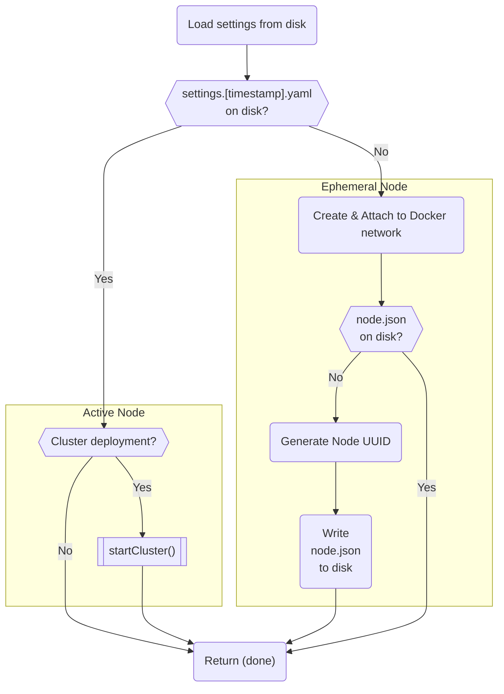

The `beforeAll` lifecycle hook is only available on the core service, and is
responsible for bootstrapping core to the point where it is able to start
services.

It will go through the following steps:

- First, it will attempt to load the Morio settings from disk.
- If no settings are stored on disk, this means Morio is running in [ephemeral state](/docs/reference/terminology/ephemeral-state/).
  - It will attempt to load the node data from disk.
  - If no node data is stored on disk, this means this is __the very first startup__.
    - It will create the Docker network, and ensure it is attached to this and no other networks
    - It will generate a UUID for the node
    - It will write the UUID to disk
  - If node data is stored on disk, it returns
- If settings are stored on disk, it will verify whether Morio is __clustered__
  - If Morio is clustered, it will call [the `startCluster()` method](/docs/guides/core/startcluster)
  - If Morio is not clustered, it will return

##### Flowchart of the `beforeAll()` core lifecycle hook

