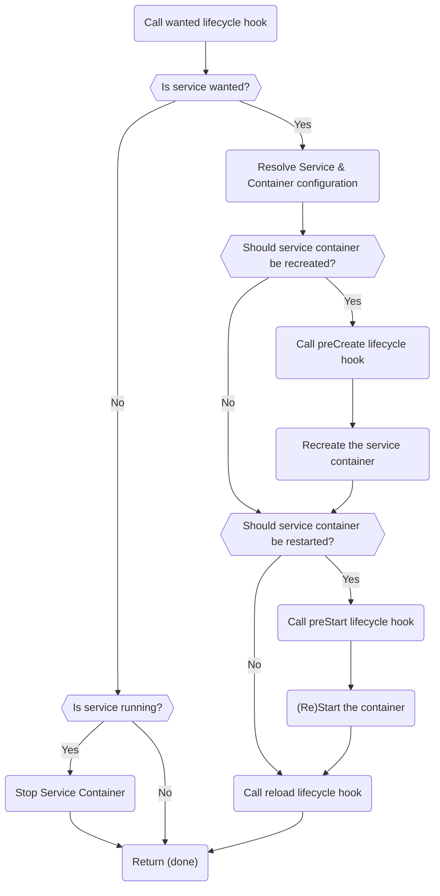

Core's `ensureService()` method ensures a service is in its desired state.

It is called from [the `startMorio()` method](/docs/guides/core/startmorio) for
services that are always running, or on-demand when a service is required, such
as the various builder services that build client packages.

The `ensureService()` method goes through the following steps:

- First, it calls [the `wanted` lifecycle hook](/docs/reference/core/hooks/wanted) of the service
- If the services __is not wanted__:
  - It will stop the service if it is running
  - It will __return early__
- If the service __is wanted__, it will resolve the service and container configuration
- Next, it will verify whether the service __needs to be recreated__
- If the service container __needs to be recreated__:
  - It calls [the `preCreate` lifecycle hook](/docs/reference/core/hooks/precreate) of the service
  - It will recreate the service container
- Then, it will verify whether the service __needs to be restarted__
- If the service __needs to be restarted__:
  - It calls [the `preStart` lifecycle hook](/docs/reference/core/hooks/prestart) of the service
  - It (re)starts the service container
  - It calls [the `postStart` lifecycle hook](/docs/reference/core/hooks/poststart) of the service
- Finally, it calls [the `reload` lifecycle hook](/docs/reference/core/hooks/reload) of the service

##### Flowchart of the `ensureService()` method inside Morio Core

