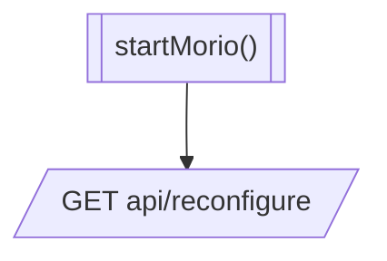

Core's `reconfigure()` method is responsible for (hot-re)loading the Morio configuration.

It is called on [initial startup](/docs/guides/core/starup) to load the
configuration, as well as after [setup of the initial
settings](/docs/guides/core/setup), [deployment of new
settings](/docs/guides/core/deplow), or any scenario that requires a 
reload of the settings.

The `reconfigure()` method only does two things:

- It calls [the `startMorio()` method](/docs/guides/core/startmorio)
- It informs the Morio API a reconfiguration has occured

##### Flowchart of the `reconfigure()` method inside Morio Core

