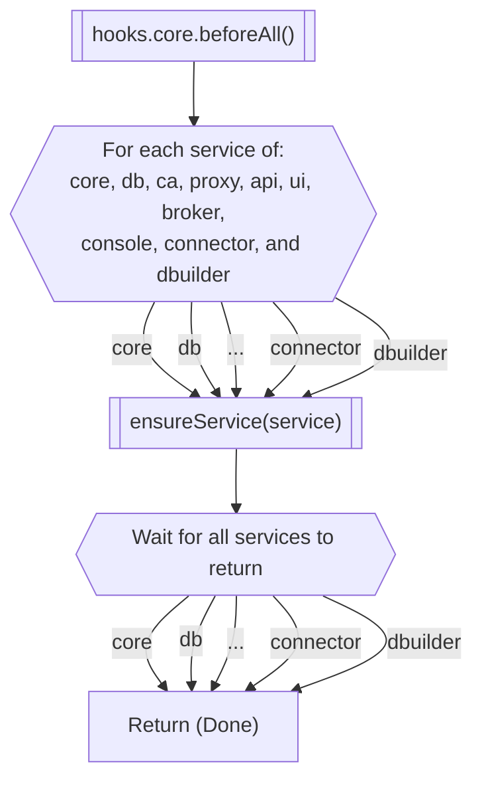

Core's `startMorio()` method does what needs to be done to either
cold-start Morio, or handle [a reconfigure event](/docs/guides/core/reconfigure).

First, this method will call [the `beforeAll` lifecycle
hook](/docs/guides/core/beforeall) for the core service.  
After that, it will iterate [the list of services](/docs/reference/services)
and call [the `ensureService()` method](/docs/guides/core/ensureservice) for
each of them.

##### Flowchart of the `startMorio()` method inside Morio Core

## What is the store?

Core's __store__ is an in-memory data structure where it keeps volatile state.

In other words, the data inside the store is not persisted to disk, and when
core restarts, the data is lost and the store will be re-initialized.

The store is also local to the core instance, and not distributed when
clustering Morio.
