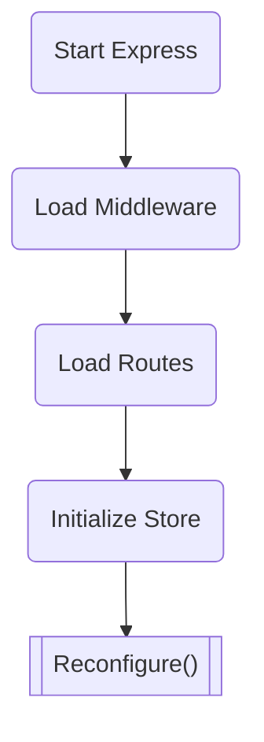

Morio Core is an [Express](https://expressjs.com/) app running inside 
a [Docker](https://www.docker.com/) container under supervision 
of [the PM2 process manager for NodeJS](https://pm2.keymetrics.io/).

Upon its initial startup, it starts the Express app, adds middleware and routes,
initializes [the store](#what-is-the-store) where we keep state, and finally it will call the
[reconfigure()](/docs/guides/core/reconfigure) method.

##### Flowchart of the initial startup flow

## What is the store?

Core's __store__ is an in-memory data structure where it keeps volatile state.

In other words, the data inside the store is not persisted to disk, and when
core restarts, the data is lost and the store will be re-initialized.

The store is also local to the core instance, and not distributed when
clustering Morio.
