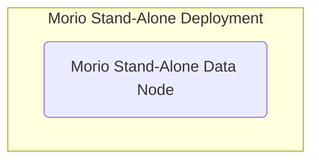
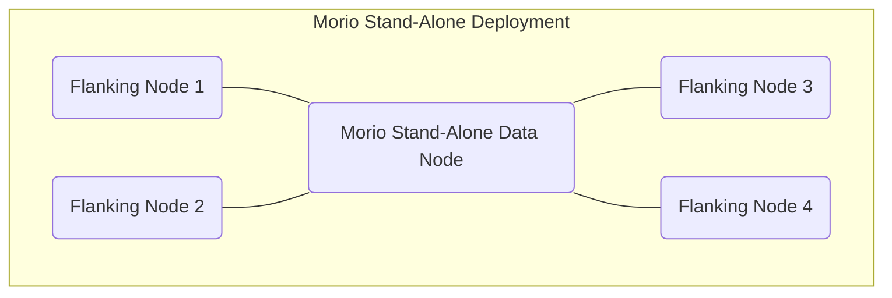
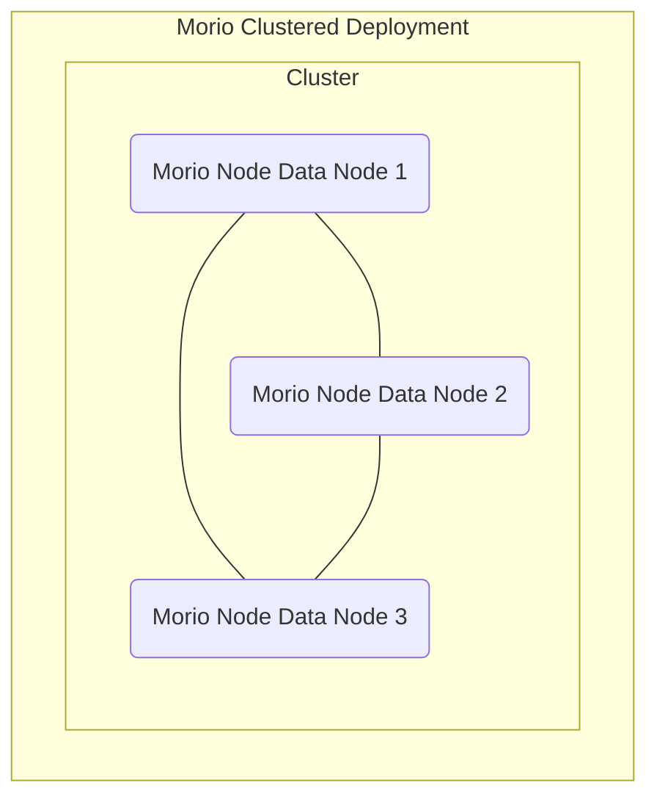
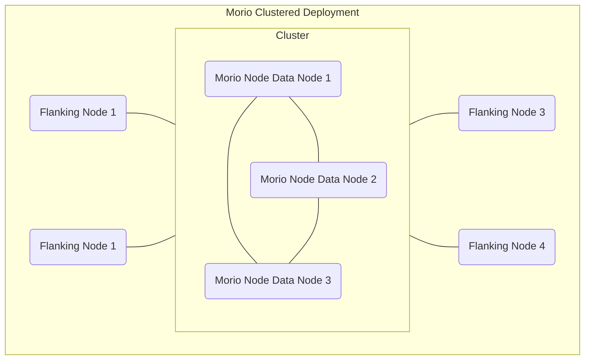

Morio can be set up as a [stand-alone][s] deployment, or as a [clustered][c]
deployment. In addition, one or more flanking nodes can be added to each of
these deployment types.

<Related>
Refer to [node types](/docs/guides/nodes) to understand the role of flanking nodes.
</Related>

## Stand-alone deployment

The simplest Morio deployment is a single data node running all services.

<WithCaption caption="Schematic overview of a stand-alone deployment">

</WithCaption>

### Stand-alone deployment with flanking nodes

Flanking nodes can be added to a stand-alone deployment, allowing horizontal
scaling of all services that can run on flanking nodes.

<WithCaption caption="Schematic overview of a stand-alone deployment with flanking nodes">

</WithCaption>

<Note>
There are no constraints on the number of flanking nodes you can add to a Morio deployment.
</Note>

## Clustered deployment

In a clustered deployment, Morio forms a distributed system between several data nodes.
The cluster sizes we support are 3, 5, 7, or 9 nodes.

<WithCaption caption="Schematic overview of a 3-node clustered deployment">

</WithCaption>

<Note>
There is no reason that you cannot deploy a larger cluster, we just don't test for those scenarios.
</Note>

### Clustered deployment with flanking nodes

Flanking nodes can be added to a stand-alone deployment, allowing horizontal
scaling of all services that can run on flanking nodes.

<WithCaption caption="Schematic overview of a 3-node clustered deployment with flanking nodes">

</WithCaption>

[s]: #stand-alone-deployment
[c]: #clustered-deployment
