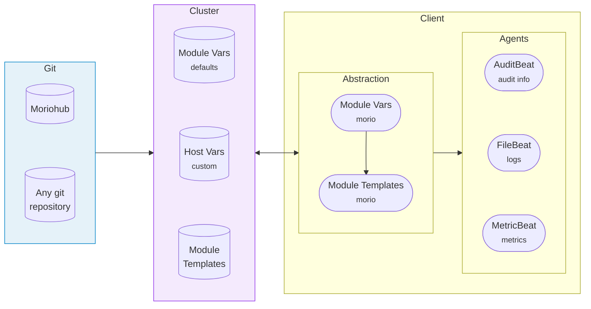
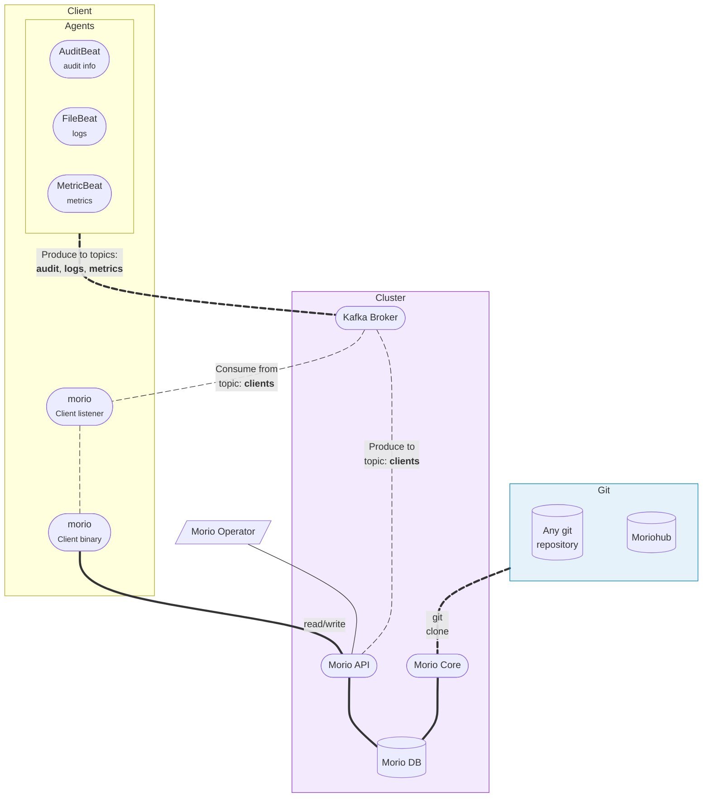

The Morio client forms an integral part of a Morio deployment.
It gathers and ships data from your systems to your Morio cluster.

To do so, it leverages various agents from the [Beats
family](https://www.elastic.co/beats), which you may already be familiar with.

However, it does more than that, and this guide will give you a good
understanding of the Morio client and the abstractions it provides, 
so that you can get the most value from it.

## High level overview

As we mentioned, the Morio clients uses various Beats agents to collect and ship data.
However, assuming _it's just Beats_ -- and potentially using it like this -- will not
be the best experience, as the client provides higher-level abstractions to
help you manage clients at scale.

So before we dive into the details, let us take a moment to
ensure we have a good mental model of what the client is and does.
The schematic overview below will help us get there:



Rather than explain everything in this diagram, we will refer to it in this
guide as we make progress.

### Low level: Just Beats {#beats}

The Morio client bundles various observability agents, based on the [Beats
framework](https://www.elastic.co/beats) by Elastic.
When you install the Morio client, the various Beats agents will be installed on
your system as well, and you will be able to interact with them directly if you so wish.

Strictly speaking, you don't even need the Morio client. You can install the
Beats you want, and manually configure them to send data to Morio.

:::tip Already using Beats?
If you are already using Beats on a system, you can still install the Morio
client.  We make sure to not use any of the various Beats default configuration
or data locations. So the Morio client can run side by side with your existing
use of Beats agents.

Furthermore, while we do setup the Elastic software repository in the
`morio-repo` package to ensure the various Beats dependencies can be installed,
we configure it with a lower than default priority. So if you are installing
Beats from a different software repository, Morio will use that repository.
:::

### Mid level: Local module templates and vars {#templates}

The various Beats agents have -- apart from their base configuration -- a bunch
of modules and/or inputs (the terminology depends a bit on the type of agent),
which determine what data on a system will be collected.

Managing this at scale gets tired quick, so this is where Morio adds the first
abstraction by using __module templates and vars__.

#### Morio client templates

A Morio client template is a modular piece of agent configuration. It can
describe what log files to collect (for Filebeat), what files to watch for
changes (for Auditbeat), or what metrics to collect (for Metricbeat), and 
so on.
As we like to [keep things simple](/docs/guides/goals/#design-goals), we
_bundle_ templates for the various agents into a single _module_ by naming
convention. Then, the Morio client can enable or disable such a _module_,
which means that rather than having to manage 3 individual agents, you have
one single integrated configuration.

We maintain a curated list of templates [on 
Moriohub](https://github.com/certeu/moriohub). We consider this a communal 
effort to take the drudge out of configuring observability.
For example, why does everyone running an NGINX web server have to come up
with their configuration? They shouldn't, not when you can use a template
instead, and just enable the `linux-nginx` module (as an example).

If at this point you are thinking _But you don't know where I store my NGINX
logs!_, then thank you for providing the perfect segue to our next point.

#### Morio client vars

Invariably, no template can work out of the box for everyone. 
Perhaps logs are stored in a different location.
Maybe on your production systems you are looking to collect more metrics than
on your testing systems, and so on.

That's where Morio client vars come in. Template authors can use a variable
rather than hard-code these settings. Furthermore, they can define a default
for the variable. If that default works for you, great. If not, you merely need
to set the variable to override the default.

You can set these variables with the Morio client, or you can use any
automation tool you like because these vars are just files.  The filename is
the name of the variable, and its contents its value. Because
you know, [we like to keep it simple](/docs/guides/goals/#design-goals).

### High level abstraction: Centralised client management {#fleet}

Having module templates and vars already makes it a lot easier to maintain a
library of agent configuration that you can re-use across your systems.
But it does not help with distributing these module templates, 
or managing these vars in a centralised way.

It is certainly possible to leverage some automation tool, be it Ansible or
whatnot, to take on this task, but it's a chore.

This is why the Morio client offers another high level abstraction that allows
you to centrally manage both the client's module templates and vars.

In this scenario, the Morio Cluster stores information about the various
available module templates, as well as their default vars. In addition, it can
also keep track of host-specific vars that override these defaults.

The end result is that a client can _pull_ the configuration from the cluster
providing centralised management.

Clients can do more than _pull_ their configuration, we'll cover that in the
next section.

## Morio data flows

We already knew that the client bundles agents that ship their data to the
Morio Cluster.  Now we've also learned that there's a possibility to _pull_ the
configuration, which begs the question, how does this all work?

The diagram below outlines the different data flows, specific to the client:



:::tip Legend
- __Line animation__:
  - <svg width="100" height="10"><path d="M 5,5 L 95,5" stroke-linecap="round" stroke="currentColor" stroke-width="3" stroke-dasharray="10 4"><animate attributeName="stroke-dashoffset" from="0" to="-28" dur="1s" repeatCount="indefinite"/></path></svg>
    Unidirectional data flow
  - <svg width="100" height="10"><path d="M 5,5 L 95,5" stroke-linecap="round" stroke="currentColor" stroke-width="3"/></svg>
    Bidirectional data flow
- __Line width__:
  - <svg width="100" height="10"><path d="M 5,5 L 95,5" stroke-linecap="round" stroke="currentColor" stroke-width="3"/></svg>
    Always-on data flow
  - <svg width="100" height="10"><path d="M 5,5 L 95,5" stroke-linecap="round" stroke="currentColor" stroke-width="1"/></svg>
    Optional data flow (only when client listener is enabled)
- __Connections__:
  - Client to Cluster: `tcp:443`<sup><small>https</small></sup> & `tcp:9092`<sup><small>kafka</small></sup>
  - Cluster to git hosts `tcp:443`<sup><small>https</small></sup>
    <br /><small><b>Note:</b> You can configure git hosts on a non-default HTTPS port or over plain HTTP, but HTTPS is typical</small>
:::

### Data plane

The data plane is relatively simple:

- Agents on the system running the Morio Client send data to the Kafka broker on the Morio Cluster.
  In the world of Kafka and streaming data, this is referred to as _producing data_.
  Each agent produces to a topic that is tied to the agent type:
  - Auditbeat produces to the __audit__ topic
  - Filebeat produces to the __logs__ topic
  - Metricbeat produces to the __metrics__ topic
- The Morio client binary sends data about the system it is running on to the Morio Cluster.
  <br /><small><b>Note:</b> This is initiated via the `morio join` or `morio report` client commands.</small>

### Control plane

The control plane only comes into play when using [centralised client management](#fleet).
In that scenario, these are the additional data flows:

- The _core service_ will preseed client templates from the configure git providers, and store them in the _db service_.
- The client can use the `morio pull` command to load its configuration from the Morio cluster, via the _API service_.
- The client can use the `morio push` command to send its local configuration to the Morio cluster, via the _API service_.
- When running the client listener:
  - A Morio operator can leverage the _api service_ to issue commands to one, several, or all clients.
  - The _api service_ will generate a unique command ID and store it in the _db service_.
  - The _api service_ will then produce a message in the `clients` topic of the _broker service_ that holds all info about the command and the unique command ID.
  - The client listener will consume the message from the `clients` topic, it will run the requested command, and report back to the _api service_ about its progress and results for the given command ID.

:::info The Morio client does not listen on any ports
The Morio client's _listener_ does not listen on any TCP ports. Instead, it
daemonises and connects to the _broker service_ where it listens for (consumes)
events in the `clients` topic.

This, in combination with the Morio client's access to the _api service_
establishes a two-way control plane between cluster and client, without the
client actually listening for any connections.
:::

## The `morio` binary

The Morio client will install the `morio` binary on your system.

You can try it out yourself by running:

```
sudo morio
```

:::info sudo required
Since the Morio configuration is only accessible to the root user --
and the client needs to be able to manipulate these files -- 
you should preseed all commands with `sudo`. 

We won't include `sudo` in every example, but keep it in mind.
:::

:::tip See the client reference documentation
For a complete overview of all client capabilities, please refer to [the Morio
client reference documentation](/docs/reference/bin/client/).
:::

### Help and version info

To get help help on how to use the client, run:

```
morio help
```

To get help on a specific command, use the `--help` or `-h` flag.

To get the client version, run:

```
morio version
```

### Agent pass-through

You can invoke any of the agents through the client:

<Tabs>
<TabItem value="audit" label="Auditbeat">

```sh
morio audit
```

</TabItem>
<TabItem value="logs" label="Filebeat">

```sh
morio logs
```

</TabItem>
<TabItem value="metrics" label="Metricbeat">

```sh
morio metrics
```

</TabItem>
</Tabs>

Doing so invokes the relevant beat with the correct configuration and data paths.

As an example, to test the Filebeat output, you can run:

```
morio logs test output
```

Refer to the relevant beats documentation or the inline help for more info.


Available Commands:
  reset       Reset the client configuration
  restart     Restart agents
  start       Start agents
  status      Shows agents status
  stop        Stop agents

### Modules, templates, and vars

#### Modules

You can manage the list of (locally) enabled modules with the `modules` command.

To list the currently enabled modules:

```
morio modules list
```

To enable a module:
```
morio modules enable linux-system
```

#### Vars

To set a variable, use the `vars` command:

```
morio vars set MY_VAR "Some value"
```

To show all vars, use:

```
morio vars list
```

#### Templates

Modules are made up of one or more templates, which can use one or more vars.

To gather all your modules and vars and turn them into a valid agent configuration, run the `template` command:

```
morio template
```

### Client enrolment

To enrol a client, you _join_ it to a cluster passing it the cluster FQDN:

```
morio join my.cluster.morio.it
```

To enable a central module, you may want to first list all the modules available on the cluster:

```
morio modules list-remote
```

And then perhaps enable one or more modules:

```
morio modules enable-remote linux-system
```

Once the cluster knows what modules to assign to this client, you can _pull_ the configuration:

```
morio pull
```

If you've made local changes to vars or enabled modules you want to store centrally, use the `push` command:

```
morio push
```

