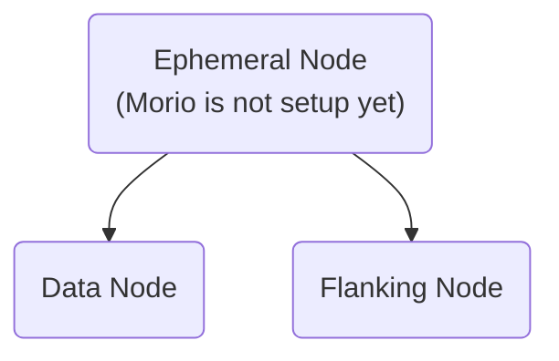

A Morio node can be an [ephemeral node][e], 
a [data node][d], or a [flanking node][f].

## Ephemeral nodes

Every Morio node starts out as an ephemeral node, running the following services:

- [api][api]
- [core][core]
- [proxy][proxy]
- [ui][ui]

Ephemeral nodes are typically not ephemeral for very long, and will become
either a [data node][d] or [flanking node][f] when they receive their initial
settings.

<Warning>
##### Beware of spawn campers

When you deploy a new Morio node, it will be ephemeral by default, and anybody
who has HTTPS access to it will be able to set it up.

Either firewall off the HTTPS port until the node is configured, or make sure
to keep the amount of time the node remains ephemeral to a minimum.
</Warning>

## Data nodes

[Data nodes][d] are the most common type of Morio node.
Data nodes can be stand-alone or clustered, but in both cases they run at least
the following services:

- [api][api]
- [broker][broker]
- [ca][ca]
- [console][console]
- [core][core]
- [db][db]
- [proxy][proxy]
- [ui][ui]

Of these services, it is [the broker service][broker] that forms the streaming
data heart of a Morio deployment, and this is also the service that comes 
with constraints on scaling data nodes due to the way data is shared across
cores and nodes.

Specifically, the following constraints are in place:

- **Vertical scaling**: You can not reduce the number of cores
- **Horizontal scaling**: You cannot change the number of nodes

<Important>
Technically, it is possible to scale a Morio cluster horizontally by adding more data nodes.
But it is currently not supported to do this via the Morio API.
</Important>

## Flanking nodes

Flanking nodes are different from data nodes in that they do not form a
distributed system. Rather, they are clients of the distributed system that is
formed by one or more Morio data nodes.

Flanking nodes can run any service that is supported as a flanking service.
Currently the only supported flanking service is [the connector
service][connector] but we plan to add more flanking services in the future.

<Fixme>Update this when more flanking services are available</Fixme>

[e]: #ephemeral-nodes
[d]: #data-nodes
[f]: #flanking-nodes
[api]: /docs/reference/services/api
[broker]: /docs/reference/services/broker
[connector]: /docs/reference/services/connector
[console]: /docs/reference/services/console
[core]: /docs/reference/services/core
[ca]: /docs/reference/services/ca
[db]: /docs/reference/services/db
[proxy]: /docs/reference/services/proxy
[ui]: /docs/reference/services/ui
