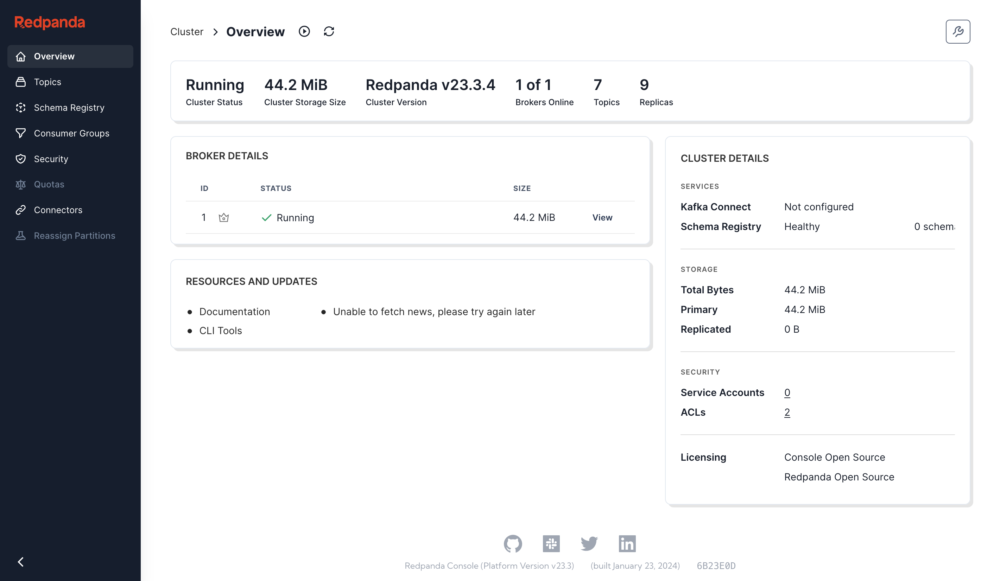

The `console` service provides an administrative GUI to RedPanda.

This service utilizes [RedPanda
Console](https://redpanda.com/redpanda-console-kafka-ui), which is where it
gets its name from.

<WithCaption caption="Screenshot of the Console service in Morio">

</WithCaption>
