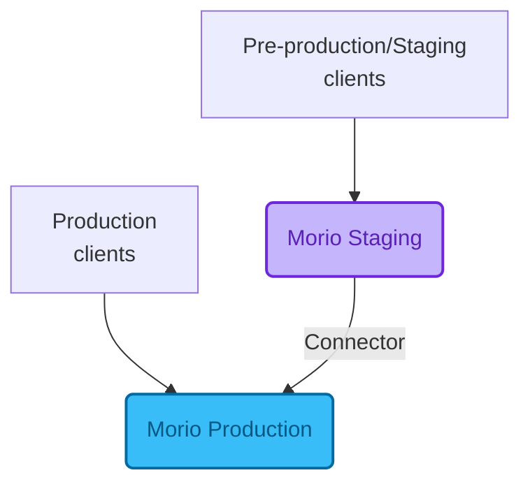

When deploying Morio, we recommend to set up a **staging instance** using the
_canary channel_.

Doing so will allow you to validate new releases in your own environment, with
your own data.

## Staging architecture

To make a staging instance useful, it should process real data that is a valid
representation of your production data.

We recommend to configure a limited number of pre-production, staging, or
development systems to send their data to your staging instance.  Then, you can
forward all data from this staging instance to your production instance using
the _connector service_.

<!-- start-skip-spellcheck -->

<!-- end-skip-spellcheck -->

This way, all data still ends up in your centralised instance, but you have the
full benefits and limited blast radius that comes with a staging instance.

## Staging new clients

Apart from providing guardrails to deploy Morio updates, a staging instance can
also help you onboard new clients.

In such a scenario, you may not want to use the connector service to forward
staging data to production, but rather onboard clients on your staging
instance, and after you've validated that everything is working as planned,
migrate them to production.

To facilitate this, you can preseed your staging instance with the keys of your
production instance.  This allows you to use the same CA root certificate,
which means you will be able to migrate clients from staging to production
without having to reconfigure their credentials.

:::tip
Refer to [the preseeding guide](/docs/guides/settings/preseed/) for more details.
:::

